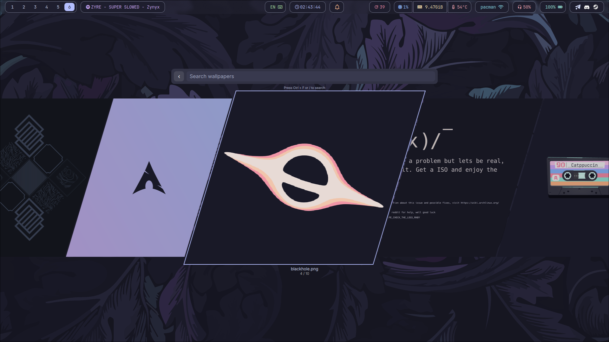

# roller

Pick a wallpaper from the keyboard: browse local files in a centered coverflow carousel, search by name, apply through whichever daemon you already run.

[](https://github.com/zyrophix/roller/actions)
[](LICENSE)



> **Status: 0.x.** No compatibility promise — config keys and rendering have
> already changed during development and will keep doing so; pin a commit if
> you depend on exact behaviour. There is no test suite yet, so bugs are
> found by hand. `awww` is the only backend exercised on a real desktop; the
> others are implemented from their documented interfaces, and `feh` does
> nothing under a Wayland compositor.

## Why roller?

| What you need | roller | Alternative |
|---|---|---|
| "flip through wallpapers fast" | GPU coverflow, `h`/`l` and wheel, no reload | file manager, or right-clicking the desktop |
| "work with the daemon I already run" | `awww`, `hyprpaper`, `waypaper`, `swaybg`, `feh`, video via `mpvpaper` | one daemon, or a per-desktop script |
| "keep it small and hackable" | ~600 KB, one C++ binary, one JSON file | a shell component needing a Quickshell install |

## Install

**Wayland only.** roller draws itself as a `wlr-layer-shell` overlay, so it needs a compositor implementing that protocol — Hyprland, Sway, Wayfire, labwc, niri, river. It will not start on X11; the shell import in `qml/Main.qml` is unconditional and there is no fallback window type.

Build needs Qt **6.8+** (`Quick`, `Gui`, `Core`, `Concurrent`) and `layer-shell-qt`. Runtime needs one backend from the table below. `ffmpeg` is used only for video poster frames, `sh` only for `post_apply_command`. No `jq`, no ImageMagick.

```sh
# Arch
sudo pacman -S qt6-base qt6-declarative layer-shell-qt awww

git clone https://github.com/zyrophix/roller
cd roller
cmake -B build -S . && cmake --build build
sudo install -Dm755 build/roller /usr/local/bin/roller
```

## Quickstart

Layer rule plus a keybind, so the overlay is not blurred and a key opens it:

```lua
hl.layer_rule({
  match = { namespace = "^(roller)$" },
  blur = false,
  ignore_alpha = 0,
})

hl.bind("SUPER + W", hl.dsp.exec_cmd("roller"))
```

Point it at your wallpapers:

```sh
mkdir -p ~/.config/roller
cp config.example.json ~/.config/roller/config.json
$EDITOR ~/.config/roller/config.json
roller
```

Expected output on start:

```text
roller: config /home/you/.config/roller/config.json
```

The resolved config path is printed every launch. A second `roller` exits and reports the pid that already holds the lock.

## Usage

Press `h` and `l`, or scroll, to move; `Enter` applies.

### Keybinds

| Key | Action |
|---|---|
| `h` / `←` | Previous wallpaper |
| `l` / `→` | Next wallpaper |
| `d` / `u` | Jump one page forward / back |
| `Enter` / `Space` | Apply selected — inside search it only confirms the query |
| `Ctrl+F` / `/` | Toggle search. `/` types normally while the field has focus |
| `Esc` | Clear search, or quit |
| `Wheel` / `Drag` | Scroll |
| `Click` | Select, or apply if already selected |

### Command line

| Flag | Effect |
|---|---|
| `-h`, `--help` | Usage |
| `-v`, `--version` | Version |
| `--allow-multiple` | Skip the single-instance lock, for development |

### Backends

Set with `"backend"` in `config.json`:

| Value | Needs | Notes |
|---|---|---|
| `auto` *(default)* | — | Picks the first backend actually installed, in this order |
| `awww` / `swww` | `awww` + `awww-daemon` | Supports transitions. `swww` is the former name, same binary |
| `hyprpaper` | `hyprpaper` daemon | Hyprland native, via `hyprctl` |
| `waypaper` | `waypaper` | |
| `swaybg` | `swaybg` | roller replaces the instance it started on the next change |
| `feh` | `feh` | **X11 only** — sets the X root window that a Wayland compositor draws over, so under Hyprland it reports success and changes nothing |

An unknown or unavailable name falls back to the first installed backend. The name actually used is in the startup log.

### Video wallpapers

Files whose extension is in `video_extensions` always go through `mpvpaper`, whatever the configured backend — none of the static-image backends can render video. The focused monitor comes from `hyprctl`, falling back to `swaymsg`.

`mpvpaper` is started **without** `-f`, so its pid is known and the previous instance can be replaced precisely. Any later wallpaper change stops a running video wallpaper; the match is limited to files under `wallpaper_path`, so an `mpvpaper` you started yourself is untouched.

Video costs CPU. `mpv` defaults to `--hwdec=no`, so decoding happens on the processor; on hardware without a decoder for the codec — 4K AV1 on AMD Vega, for instance — this can pin several cores.

### Configuration

Read from, in order:

1. `$XDG_CONFIG_HOME/roller/config.json` — canonical, usually `~/.config/roller/config.json`
2. `../config.json` next to the binary — portable tree installs

The working directory is **not** searched, so a stray `config.json` cannot silently change behaviour. `config.example.json` in this repo is a template, not a live config. `~` in a path expands to `$HOME`.

| Key | Default | Meaning |
|---|---|---|
| `wallpaper_path` | `~/Pictures/Wallpapers` | Scanned recursively |
| `cache_path` | `~/.cache/roller/thumbs` | Thumbnail cache |
| `number_of_pictures` | `5` | Visible tiles, clamped 1–64 |
| `panel_height` | `500` | Carousel height, clamped 1–2160 |
| `selected_horizontal_scale` | `1.6` | Selected tile width scale, 1.0–4.0 |
| `selected_vertical_scale` | `1.1` | Selected tile height scale, 1.0–4.0 |
| `carousel_selected_border` | `#b4befe` | Selected tile border colour |
| `border_color` | `#b4befe` | Legacy alias for the above |
| `border_width` | `2` | Selected tile border |
| `idle_border_width` | `2` | Unselected tile border, `0` hides it |
| `idle_border_color` | `#585b70` | Unselected tile border colour |
| `thumbnail_height` | `512` | Thumbnail height px, 128–2160 |
| `cache_max_mb` | `256` | On-disk cache bound, oldest evicted first |
| `restore_last` | `true` | Reopen on the last applied wallpaper |
| `backend` | `auto` | See [Backends](#backends) |
| `video_extensions` | `mp4 webm mov avi mkv gif m4v flv wmv mpeg 3gp` | Matched case-insensitively |
| `transition_type` | `grow` | awww only, unknown values fall back to `grow` |
| `transition_pos` | `0.5,0.5` | awww only |
| `transition_duration` | `1.2` | awww only, clamped 0–10 |
| `transition_fps` | `60` | awww only, clamped 1–240 |
| `stable_copy_path` | `""` | Copy the current wallpaper here for lockscreens or bars |
| `post_apply_command` | `""` | Shell hook after every change, e.g. `wallust run` |
| `search_background_color` | `#313244` | |
| `search_text_color` | `#cdd6f4` | |
| `search_hint_color` | `#a6adc8` | |
| `search_hint_text` | `Press Ctrl + F or / to search` | |
| `show_search_hint` | `true` | |

### Thumbnails

Generated in the background on launch into `cache_path`, keyed by `md5(absolute source path)`, always stored as JPEG. Sizing is height-driven, like `magick -thumbnail x512`; a thumb is regenerated when its height is more than 6% off the target. Videos get a poster frame from `ffmpeg`, seeked to 1s because the first frames of a clip are often black.

`thumbnail_height` defaults to 512 deliberately: at 16:9 a 910×512 thumb is 1.86 MB as ARGB32, which fits Qt's 2 MiB unreferenced pixmap cache limit, while 550 does not. It is also a tier in the [freedesktop thumbnail standard](https://specifications.freedesktop.org/thumbnail/latest/thumbsave.html).

Thumbs whose wallpaper is gone are deleted, and the oldest are evicted once the directory passes `cache_max_mb`. `make clean-cache` drops the whole cache.

### Notes for contributors

Two decisions are not guessable from the code alone:

- Delegate slots are pinned to absolute indices (`slotVIdx` plus `syncSlots`) rather than derived from the rounded centre. Deriving them shifts every pooled delegate on each half-step, so every tile changes source mid-slide and paints the previous wallpaper. The carousel is not linear, which is why a `ListView` does not fit here.
- QML bindings that call `Q_INVOKABLE` getters never re-evaluate on `dataChanged`. The delegate bindings read `model.rev` for that reason.

## Repo overview

- `qml/` — `Main.qml` overlay, layout and keybinds; `Carousel.qml` coverflow and delegate pool; `SearchBar.qml` debounced field
- `src/` — `main.cpp` CLI, single-instance lock, config resolution, QML engine
- `src/backend/` — repository scan, model, filter proxy, thumbnail worker, backend dispatch
- `config.example.json` — config template
- `.github/workflows/ci.yml` — build and test

## Contributing

PRs welcome: fork → branch → PR. Build and lint before submitting:

```sh
cmake -B build -S . && cmake --build build
make lint
```

Full guide: [CONTRIBUTING.md](CONTRIBUTING.md).

## License

MIT — see [LICENSE](LICENSE).
